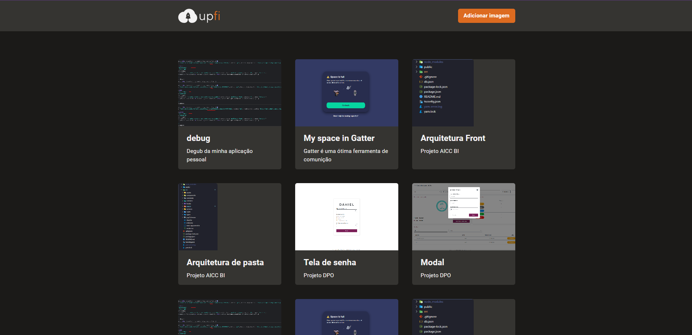

<h1 align="center">upfi</h1>
<h2 align="center">Rocketseat - Ignite - ReactJS</h2>

<h3 align="center">Chapter #4</h3>

  <a href="#-Project">Project</a>&nbsp;&nbsp;&nbsp;|&nbsp;&nbsp;&nbsp;
  <a href="#-Technologies">Technologies</a>&nbsp;&nbsp;&nbsp;|&nbsp;&nbsp;&nbsp;
  <a href="#-Layout">Layout</a>&nbsp;&nbsp;&nbsp;|&nbsp;&nbsp;&nbsp;
  <a href="#-How-to-execute">How to execute</a>&nbsp;&nbsp;&nbsp;|&nbsp;&nbsp;&nbsp;
  <a href="#-Licence">Licence</a>

  

## 💻 Project

Upfi is a platform to upload images. This is the eighth challenge of ReactJS track of Ignite course from [Rocketseat](https://rocketseat.com.br/).

## ✨ Technologies

This project was developed with the technologies above:

- [React](https://reactjs.org)
- [TypeScript](https://www.typescriptlang.org)
- [NextJS](https://nextjs.org)
- [Chakra UI](https://chakra-ui.com/)
- [Fauna](https://fauna.com)
- [React Query](https://react-query.tanstack.com)
- [React Hook Form](https://react-hook-form.com)

## 🔖 Layout

You can view the project layout through [this link](<https://www.figma.com/file/39WZ6vu40qOsOjXwSUZ91B/Desafio-2-M%C3%B3dulo-4-ReactJS-(Copy)?node-id=23%3A50>). You must have a [Figma](http://figma.com) account to access it.

## 🚀 How to execute

- Clone the repository
- Create a new database on [Fauna](https://fauna.com)
- Create a new collection `images` on the database
- Copy the api key from the Fauna dashboard
- Create a account on [imgbb](https://imgbb.com/)
- Copy the api key from the imgbb dashboard
- Copy the `.env.example` file to `.env`
- Set the api keys on the `.env` file
- Install de dependencies with `yarn`
- Run the application with `yarn dev`
- Access [`localhost:3000`](http://localhost:3000) in your browser

## 📄 Licence

This project is under the MIT license. See the [LICENSE](./LICENSE) file for more details.

---

Made with ♥ by Samael Melo and Rocketseat
